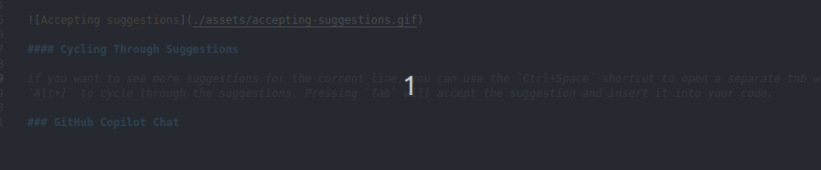
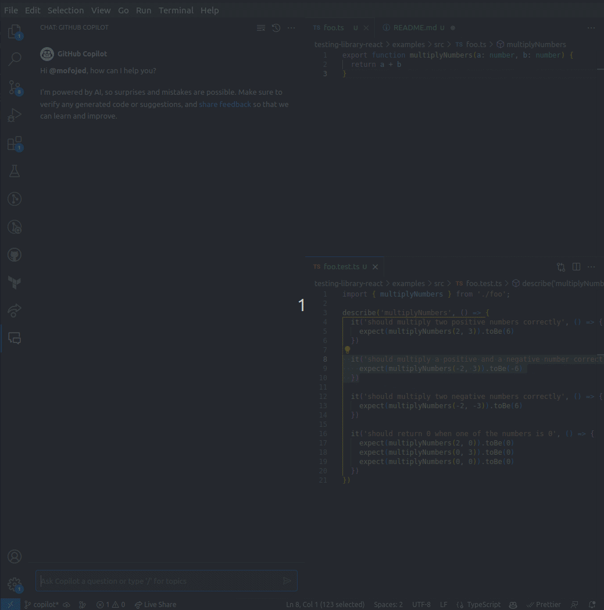

# Copilot Lunch 'n' Learn

## What is Copilot?

GitHub Copilot is an [AI pair programmer](https://docs.github.com/en/copilot/quickstart), powered by GPT-4. At it's core, it's essentially supercharged autocomplete. It uses machine learning to provide suggestions for code as you type. It is trained on billions of lines of public code, and can provide suggestions for a variety of languages and frameworks. New features are being added all the time, and it is constantly improving. Copilot Chat is current in beta, and only available in VS Code right now. Copilot Voice is currently in alpha, and not available to the public (or Deephaven) yet.

### What is Copilot Good For?

- [Generate code suggestions](https://docs.github.com/en/copilot/getting-started-with-github-copilot)
- Write unit tests
- Filling in boiler plate code
- Adding doc strings to functions
- Ask questions about your code
- Find bugs in the code

### What is Copilot Not Good For?

- Writing entire functions for you: Copilot excels are providing short answers
- Reading your mind: Copilot can only work on what it knows, meaning code that you have open in your editor, or code that it has seen before. It cannot read your mind and know what you want it to do.
- Compiling code: Copilot is not a compiler, so sometimes the suggestions it provides are invalid (though they may still be useful).

## Setup

GitHub Copilot is set up for the Deephaven organization. All you need to do to use it is install the GitHub Copilot extensions.

1. GitHub Copilot extension: This extension is available for [Visual Studio Code](https://docs.github.com/en/copilot/getting-started-with-github-copilot?tool=vscode#installing-the-visual-studio-code-extension) and [IntelliJ/PyCharm/JetBrains IDEs](https://docs.github.com/en/copilot/getting-started-with-github-copilot?tool=jetbrains#installing-the-github-copilot-extension-in-your-jetbrains-ide). Using this extension you can get code suggestions from Copilot while you are coding, or in a separate tab.

2. GitHub Copilot Chat extension: This extension is currently in beta and only available for [Visual Studio Code](https://docs.github.com/en/copilot/getting-started-with-github-copilot?tool=jetbrains#installing-the-github-copilot-extension-in-your-jetbrains-ide). Using this extension you can ask Copilot questions about your code, to write unit tests for you, or even find bugs in your code.

## Usage

### GitHub Copilot

Providing suggestions right in line with your code, the GitHub Copilot extension is most effective for completing small tasks, such as finishing a method you are working on, adding additional unit test cases, or adding doc strings to functions. Copilot will automatically show you suggestions as you type, and you can accept them by pressing `Tab`. You can also use the `Ctrl+Space` shortcut to see suggestions for the current line in a separate tab, or `Alt+[` and `Alt+]` to cycle through suggestions.

#### Accepting Suggestions

By simply typing, GitHub Copilot will display an autocomplete suggestion in line in faded text. Simply press `Tab` to accept the suggestion and have it inserted into your code. You can also press `Esc` to dismiss the suggestion.

#### Cycling Through Suggestions

You can cycle through suggestions by using the `Alt+[` and `Alt+]` shortcuts. This will cycle through the suggestions for the current line.

#### Viewing All Suggestions

You can use `Ctrl+Enter` to view all suggestions for a given snippet. This is handy if you think Copilot should be able to provide the function for you, but the first suggestion is not what you're looking for. It is also useful for seeing multi-line suggestions.

#### Nudging Suggestions

When GitHub Copilot is not providing the suggestions you are looking for, you can add some more text or remove some text to nudge it in the right direction.

### GitHub Copilot Chat (Beta)

The GitHub Copilot Chat extension is currently in beta, and is only available for Visual Studio Code. You can use it to ask Copilot questions about specific areas of code, generate unit tests for you, or even find bugs in your code. You can access the Chat from the Extensions bar on the left (chat icon) or by pressing `Ctrl+P`, and typing `>` followed by your question and selecting the `Ask GitHub Copilot` option. You can also access options via the Copilot context menu item (right click).

For more details on the capabilities and limitations of GitHub Copilot Chat, see [the Copilot documentation](https://docs.github.com/en/early-access/copilot/github-copilot-chat-transparency-note).

#### Asking Questions

You can highlight some code or a file, and ask Copilot what that code does. It will summarize what the code does for you, which may be helpful to reason about the code if you are unfamiliar with it.

#### Generating Unit Tests

You can ask Copilot to generate unit tests for you. You can ask it to generate unit tests for a specific function, or for a specific file. It will generate unit tests for you, and insert them into your code.

This is also accessible from the context menu, where it will show the diff or test file that will be added, and allow you to Accept or Discard the changes.

#### Generating Docs

From the context menu (right click), you can access much of the Copilot Chat functionality. It will then suggest changes inline so you can see the diff, and accept the solutions.

#### Finding Bugs

You can ask Copilot to find bugs in your code. By using the extension in the side bar, you can ask follow up questions to try and guide the AI to find the bug you are looking for.

## General Tips

- **Simple, Specific, and Short:** Copilot works best when you're asking for something simple, specific, and short. If you're having trouble with the suggestions, try being more specific, or simplifying the instructions into something shorter.
- **Patterns and Examples:** Copilot, being a language model, is great at recognizing patterns. If you're not getting what you want, try providing an example of what you want, or a pattern that you want it to follow.

## Limitations

- Copilot is not a replacement for a human programmer. It is a tool to help you write code faster, but it is not perfect. It is important to review the code that Copilot generates, and make sure it is doing what you expect it to do.
- Copilot is not a replacement for writing unit tests. It can generate unit tests for you, but it is not a replacement for writing your own unit tests. It is important to review the unit tests that Copilot generates, and make sure they are doing what you expect them to do.
- Copilot can make mistakes. It is possible for it to generate code that may look correct, but is actually incorrect. It is important to review the code that Copilot generates, and make sure it is doing what you expect it to do.
- Copilot Chat can only answer questions about code that it has seen before. If you ask it a question about code that it has not seen before, it will not be able to answer your question. It also will not be able to identify architectural issues.
- Copilot is not a mindreader. Sometimes suggestions with the ghost text will be the wrong thing and can be distracting. You can disable this by setting `editor.suggest.showGhostText` to `false` in your settings.

## Resources

- [GitHub Copilot Documentation](https://docs.github.com/en/copilot)
- [Prompts, tips, and use cases](https://github.blog/2023-06-20-how-to-write-better-prompts-for-github-copilot/)
- [How GitHub Copilot is getting better at understanding your code](https://github.blog/2023-05-17-how-github-copilot-is-getting-better-at-understanding-your-code/#how-github-copilot-understands-your-code)
- [GitHub Copilot Tips and Tricks](https://youtu.be/1qs6QKk0DVc)
- [Pragmatic techniques to get the most out of GitHub Copilot](https://youtu.be/CwAzIpc4AnA)
- [GitHub Copilot Just Changed the Game](https://www.youtube.com/watch?v=IavOJI5OV7g)
- [The Truth about Github Copilot](https://www.youtube.com/watch?v=4duqI8WyfqE)
- [Game over.... GitHub Copilot X announced](https://www.youtube.com/watch?v=q1HZj40ZQrM)
- [GitHub Copilot X: The AI-powered developer experience](https://github.blog/2023-03-22-github-copilot-x-the-ai-powered-developer-experience/)
