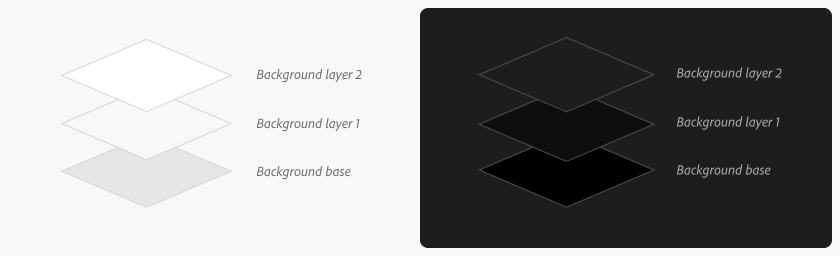
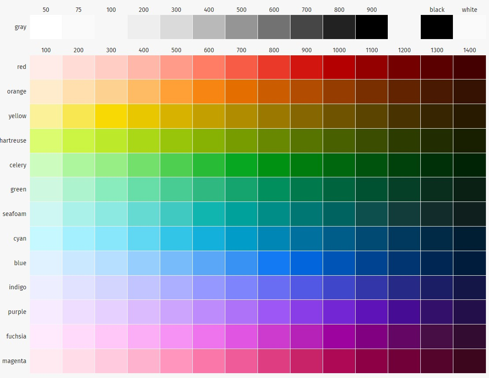
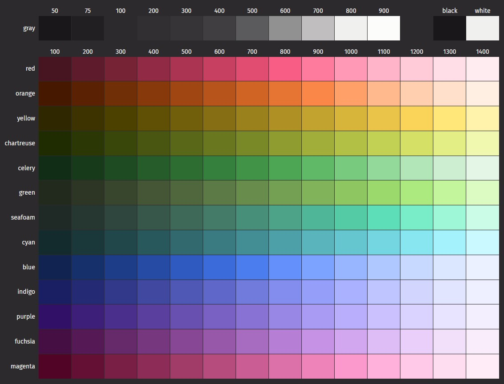
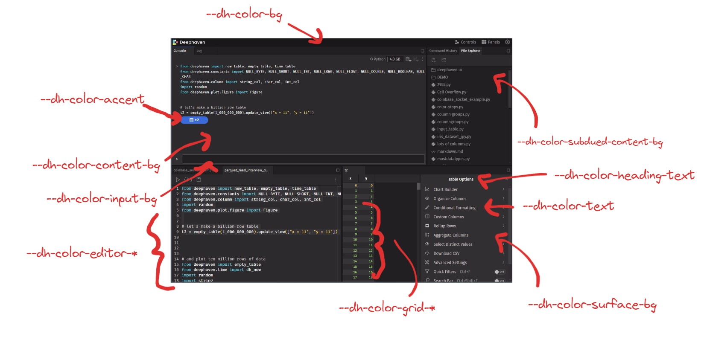
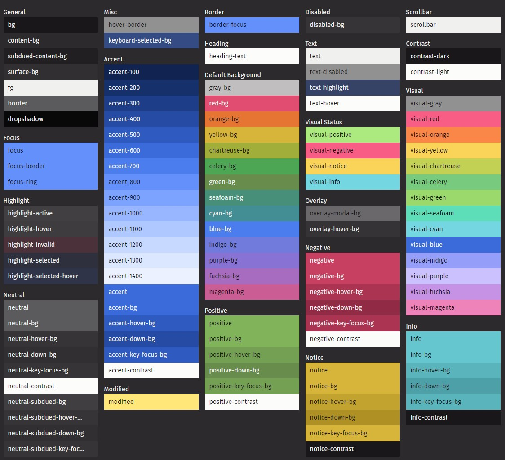
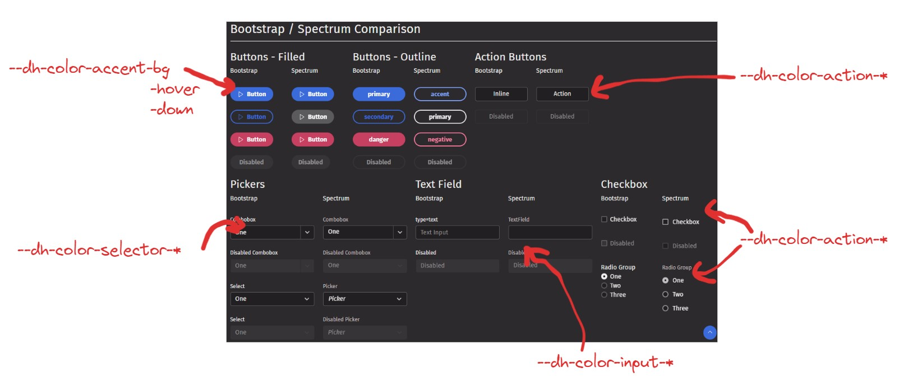

# CSS Variables for Deephaven Components

Our approach to css has been to have ~one and one match between components and css files.

This usually looks something like:

```
- MyComponent.js
- MyComponent.scss
```

Where CSS should always be nested/scoped to the component:

```scss
import './custom.scss'; // import global scss variables

$local-variable: $global-variable;

.my-component {
  .child {
    ...
    color: $local-variable;
  }
}
```

This is a good approach because it makes it easy to find the CSS for a component, and it makes it easy to see what CSS is being used by a component. And by scoping the CSS to the component, we avoid conflicts between components. We will continue to use this approach.

Historically, for variables we've used SCSS. With the adoption of spectrum we are switching to using CSS variables for our variables. CSS variables are great because they can be swapped out at runtime, which is necessary for theming. They can be used almost anywhere you would have used a variable in SCSS.

As we adopt spectrum, I expect the amount of custom CSS one has to write to continually go down. For example, the whole ACL editor has very little custom CSS. (14 styles, and I bet we could actually reduce that by half or more, as some could be props on spectrum components).


## Defining CSS variables

They are defined with a `--` prefix, and used with `var(--variable-name)`. See: [MDN](https://developer.mozilla.org/en-US/docs/Web/CSS/Using_CSS_custom_properties)

```scss
$color: red;
// vs
<some scope> { // :root is the global scope, or a CSS selector
--color: red;
}

.my-component {
  color: $color;
  color: var(--color);
}
```

```scss
:root {
  --a: 1;
  --b: 2;
  // can also contain numbers, and be used in calc
  --result: calc(var(--a) + var(--b) * 1px); // apply a unit
  // --result: 3;

  --color: invalid;
  // variable is ignored if used as a color property
  

.my-component {
  // can also specify fallback values if a value is not defined
  color: var(--my-undefined-var, red);
}
```

Fallback values to expose variables:

```scss
// spectrum uses this pattern for theming, where the component defines a variable and a fallback value
// and the user can override it by setting the undefined variable in a theme
.my-spectrum-component {
  // exposes --my-spectrum-component-color as a themeable variable, but defaults to a fallback value
  // kinda pollutes the global scope
  color: var(--my-spectrum-component-color, var(--global-color));
}

// then in theme
:root {
  --my-spectrum-component-color: blue;
}
```

vs. 

```scss
.my-spectrum-component {
  // encapsulates the variable in the component scope
  --my-spectrum-component-color: var(--global-color);
  color: var(--my-spectrum-component-color);
}

// then in theme
:root {
  --my-spectrum-component-color: blue; // wouldn't work because of specificity
}
.my-spectrum-component {
  --my-spectrum-component-color: blue; // does work
}

```

Consider this example of a button component with CSS variables and variants:

```scss
// Button.scss
.btn {
  --btn-bg-color: var(--netural-color);
  --btn-fg-color: var(--netural-text-color);

  background-color: var(--btn-bg-color);
  color: var(--btn-fg-color);
}

.btn-primary {
  --btn-bg-color: var(--primary-color);
  --btn-fg-color: var(--primary-text-color);
}

.btn-negative {
  --btn-bg-color: var(--negative-color);
  --btn-fg-color: var(--negative-text-color);
}
```

```jsx
<button class="btn btn-primary"/>
<button class="btn btn-negative"/>
```


## Inheritance

CSS variables can be defined either in the root scope, or in a selector. We **use the root scope for global theme variables**, and in **the selector for component specific variables**. Inheritance works as expected, so if a component doesn't define a variable, it will inherit the value from the root scope. Use fallbacks pattern, in the case of something you are considering a semi-private API, and prefix with `--dh` to avoid conflicts (global).

```scss
// global theme
:root {
  --global-variable: red;
}
```

```scss
// MyComponent.scss
.my-component {
  --local-color: var(--global-variable);

  .child {
    color: var(--local-color);
  }

  .child.a {
    --local-color: salmon;
  }

  .child.b {
    // dh-child-b could inherit from the root scope, and thought of as a semi-private API
    // in the sense that it's not published in the theme files, but it is in the global scope
    --local-color: var(--dh-child-b, lemonchiffon);
  }
}
```


## Variables in JS

A challenge with using inheritance is that monaco, plotly and our grid all require resolved javascript values for theming. We accomplish this by using JS to read the value of each CSS variable defined in our theme (for numbers, it getProperty, and colors by setting a background and reading the color back from the element).

```js
:root {
  --color: red;
}

const propetry = getComputedStyle(document.documentElement).getPropertyValue('--color');
// "red"
const div = document.createElement('div');
div.style.backgroundColor = 'var(--color)';
const resolved_color = getComputedStyle(div).style.backgroundColor;
// "rgb(255, 0, 0)" which we then normalize with JS to hex for use in monaco, plotly, and our grid.
```

Aside CSS properties are actually a great way to get values _from_ JS into CSS:

[Codepen Example](https://codepen.io/dsmmcken/pen/ZEPjBmy)

```js
document.addEventListener("mousemove", (e) => {
  document.documentElement.style.setProperty("--x", e.clientX);
  document.documentElement.style.setProperty("--y", e.clientY);
});
```

```scss
div {
  transform: translate(var(--x) * 1px, var(--y) * 1px);
}
```


## Start using CSS variables!

We have a theme component which manages which theme is applied. All users created themes must inherit from either a light or a dark theme.

1. All Deephaven **theme variables** start with `--dh` to avoid conflicts with other CSS variables. `--dh` variables should be thought of as a public API. Removing a `--dh` variable is a breaking change. Adding a variable is not a breaking change, as users themes inherit from the base themes, and will not break if a variable is added.
 
   Local variables to components should not start with `--dh`, but instead should follow the component name `--my-component`.

2. A theme consists of a set of CSS variables defined across a number of files. Variables added to Dark or Light theme **must be added to both base theme files**. You will rarely need to add a variable to a theme file unless we think it should be part of the public API.

3. Components should use the most specific available variable. If a **semantic _component_ variable** is available use that, otherwise it should use a **semantic variable** and lastly it should use a **palette variable**.

4. Components should almost never use palette variables directly.

   <small>Sometimes maybe a gray-*, but really mostly no.</small>

5. Components can and should define their own internal variables, scoped to the component.


Please review the /styleguide for a complete list of exposed variables.


### Stop using SCSS color variables!

Immediately discontinue use of SCSS color variables in favor of CSS variables.

- scss unit variables like $spacer-*, or $border-radius are still ok to use (for now).
- All bootstrap variables have been re-defined to use the CSS variables, but we haven't removed the scss variables yet. They should be considered deprecated.
  ex. 
  ```scss
  $content-bg: var(--dh-color-content-bg);
  $primary: var(--dh-color-accent);
  ```
- Immediately **stop using compile time color manipulation functions in scss**. This is no longer possible darken($primary, 10%) does not work against a runtime variable. However, good news is with the expanded palette, this is no longer necessary. For ex. Accent 100-1400 covers a much wider range of colors than we had before. All existing SCSS color manipulations were removed and replaced as part of theming work.
- Transparency is a special case. Since user supplied variables can be in any sRGB format we must also stop using SCSS functions for transparency. Instead of `rgba($color, 0.5)` use either a color-mix function:
  ```scss
  // mix accent and bg
  color: color-mix(in srgb, var(--dh-color-accent) 55%, var(--dh-color-bg));
  // mix accent with transparency
  color: color-mix(in srgb, var(--dh-color-accent) 50%, transparent);
  
  // or special scss functions we create which does the same thing
  // these are the only ones that seem necessary so far
  color: accent-opacity(50);
  color: bg-opacity(50);
  color: fg-opacity(50);
  color: negative-opacity(50);
  ```

**Q. Why can't I keep using $gray-850 etc?**

A. Themes don't just flop the color palettes 100-900 -> 900-100, they also re-define the semantic variables. If you use a palette variable directly, it may not look great when simply inverted. For example consider the content-bg vs. bg. In terms of palette it inverts, but in terms of application layers, bg is always darker than content-bg.




### Theme Files

ex. 
```scss
components/src/theme/theme-dark
 // defines color variables
 /theme-dark-palette.scss 
    // Palette variables should **almost never** be used directly for styling components.

    // They exist for light and dark, and are used by third-party theme creators (sRGB formats only: hex, rgb, hsl etc. not oklab, lab, lch, etc.).

    // gray is 50, 75, 100, 200, 300, 400, 500, 600, 700, 800, 900
    // we need a range of colors that are closer together for backgrounds
    // --dh-color-gray-50: #1a171a;
    // --dh-color-gray-75: #211f22;
    // --dh-color-gray-100: #2d2a2e;
    // --dh-color-gray-200: #322f33;
    // --dh-color-gray-300: #373438;
    // --dh-color-gray-400: #403e41;
    // --dh-color-gray-500: #5b5a5c;
    // --dh-color-gray-600: #929192;
    // --dh-color-gray-700: #c0bfbf;
    // --dh-color-gray-800: #f0f0ee;
    // --dh-color-gray-900: #fcfcfa;

    // red, orange, yellow, green 100-1400 etc.
 
 // applies color variables to semantic names
 /theme-dark-semantic.scss
    // Semantic variables can be used anywhere,
    // unless there is a more specific variable

    // --dh-color-bg: var(--dh-color-black);
    // --dh-color-content-bg: var(--dh-color-gray-100);
    // --dh-color-subdued-content-bg: var(--dh-color-gray-75);
    // --dh-color-surface-bg: var(--dh-color-gray-200);
    // --dh-color-fg: var(--dh-color-white);
    // --dh-color-border: var(--dh-color-gray-500);
    // --dh-color-hover-border: var(--dh-color-gray-600);
    // --dh-color-heading-text: var(--dh-color-gray-900);
    // --dh-color-text: var(--dh-color-gray-800);
    
    // --dh-color-accent: var(--dh-color-accent-600);
    // --dh-color-accent-bg: var(--dh-color-accent);
    // --dh-color-accent-hover-bg: var(--dh-color-accent-500);
    // --dh-color-accent-down-bg: var(--dh-color-accent-400);

    // --dh-color-visual-positive: var(--dh-color-green-1200);
    // --dh-color-visual-negative: var(--dh-color-red-800);
    // --dh-color-visual-notice: var(--dh-color-yellow-1200);
    // --dh-color-visual-info: var(--dh-color-cyan-1100);

 // applies palette and semantic variables to global component variables
 /theme-dark-components.scss 
    // Limited set of specific component variables to be used contextually.
    // Like if you are making a new custom input component, consider:
    // I expect this file to grow slightly over time

    // --dh-color-input-bg: var(--dh-color-gray-75);
    // --dh-color-input-fg: var(--dh-color-text);
    // --dh-color-input-border: var(--dh-color-border);


 // applies variables to indepentently themed components
 /theme-dark-semantic-grid.scss
    // used exclusively by iris-grid, not for use in other components
    // --dh-color-grid-* variables
 /theme-dark-semantic-editor.scss
     // used exclusively by monaco, not for use in other components
    // --dh-color-editor-* variables
 /theme-dark-semantic-chart.scss
    // used exclusively by plotly, not for use in other components
    // --dh-color-chart-* variables
```


## Palette Variables

For reference only, do not use directly. 

Light and dark invert their range of colors from 50-900. ie. 900 is black in light theme and white in dark theme.

Light:


Dark:



## Semantic Variables

These are variables you will probably use most often, especially:



```scss
// Probably the most used variables
--dh-color-bg
--dh-color-content-bg
--dh-color-subdued-content-bg
--dh-color-surface-bg
--dh-color-fg
--dh-color-border

// Sometimmes used, but a more specific variable is available
--dh-color-accent-### // 100 -1400

// * = Red, Orange, etc.
--dh-color-visual-*: // are basically the FG versions of the colors (used for colored text)
--dh-color-*-bg: // the BG version of the color (used for backgrounds, like on buttons)

// But there's also a more semnatic version of these as:
// accent = primary color (blue)
// positive = green
// negative = red
// notice = yellow
// info = cyan
--dh-color-visual-negative // used if you need negative text aka red.
--dh-color-negative-bg // used for things like a red button bg
--dh-color-negative-hover-bg // red buttons hover bg
--dh-color-negative-down-bg // button down bg
--dh-color-negative-contrast // text on red bg
```




## Component Specific Color Variables

Things like input states, or action button states, or item-list hover/focus states. Use these if you are creating custom compoents, like a new type of input or picker component.

Variables can and will be added here for things that we think should be promoted to be part of the Public API. For example, golden layout has a handful of additional variables necessary for theme development, defined as semantic component variables.




```scss
--dh-color-input-* // used for custom input components
--dh-color-action-*  // used for custom button or action components
--dh-color-selector-* // used for custom picker/selector components
--dh-color-item-list-* // used for custom item list components
```


## Example

For example, let's say you made a new color picker selector:

```scss
// A square with the selected color as a fill, and a border
// use the semantic input variables for the border
.my-color-selector {
    --active-color: var(--default-color, var(--dh-color-accent));

    height: 16px;
    width: 16px;
    background-color: var(--active-color);
    border: 1px solid var(--dh-color-input-border); // re-use the semantic variable
    border-radius: $border-radius; // non-colors variables are SCSS variables for now

    &:hover {
        border-color: var(--dh-color-input-hover-border);
    }

    &:focus {
        border-color: var(--dh-color-input-focus-border);
    }
}
```

