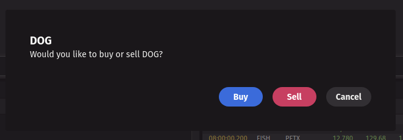

# deephaven.ui Lunch 'n' Learn

This guided session is designed to give an overview of what deephaven.ui is, how it works, and some ideas for how you can use it. This is a different than the [crash course tutorial](https://salmon.deephaven.io/core/ui/docs/tutorial/) which is designed to be self-guided, whereas this session will be more interactive, working through examples together and answering questions.

The code samples are expected to be run in order, and may use variables from previous code samples.

## What is deephaven.ui?

- Quickly build UIs from Python
- [React](https://react.dev/)-like approach to building components
- Stock toolkit of themeable components based on [Adobe Spectrum](https://react-spectrum.adobe.com/react-spectrum/index.html)
- Custom components can be created and parameterized for reusability
- Docs: https://salmon.deephaven.io/core/ui/docs/

## Why deephaven.ui?

- Allow building custom widgets and layouts quickly, without needing to install new plugins
- Great flexibility - interact with other frameworks we haven’t thought about yet
- Opportunity to create and share custom widgets, interact with other frameworks
- Some example widgets: https://gist.github.com/search?q=deephaven.ui

## What can you do with deephaven.ui?

For all the examples below, it is assumed you have already imported the `deephaven.ui` module. This module is access to all the `deephaven.ui` functionality:

```python
from deephaven import ui
```

### Display/layout information

- Many different components provided to display and layout information
- Layout within a component: flex, tabs, grid, view
- Layout within a dashboard: column, row, stack
- Emphasize information: heading, inline_alert, illustrated_message
- Provide guidance: markdown, contextual_help

Example displaying simple text:

```python
x = ui.text("Hello, world!")
```

Example to display large text, using a `heading` instead of `text`:

```python
x = ui.heading("Hello, world!")
```


Wrap stuff with `ui.view` and give it some colour:

```python
x = ui.view(ui.heading("Hello, world!"), background_color="positive")
```

**Note**: With colours, we encourage use of semantic names for colours, e.g. using "positive" instead of "green". This will ensure that the colour is themed correctly for the user's environment.

You can also use `ui.flex` to lay out multiple components vertically in a _column_:

```python
column_example = ui.flex(
    ui.view(ui.heading("Hello, world!"), background_color="positive"),
    ui.view(ui.heading("Goodbye, world!"), background_color="negative"),
    direction="column",
)
```


Or change the direction to layout horizontally in a _row_:

```python
row_example = ui.flex(
    ui.view(ui.heading("Hello, world!"), background_color="positive"),
    ui.view(ui.heading("Goodbye, world!"), background_color="negative"),
    direction="row",
)
```


Those headers are taking up the full height of the panel. This is because the parent container by default is a flexbox, and the `flex` component will grow to fill it. If we don't want those components to take up the full height, we can set the `flex_grow` property to `0`:

```python
row_example = ui.flex(
    ui.view(ui.heading("Hello, world!"), background_color="positive"),
    ui.view(ui.heading("Goodbye, world!"), background_color="negative"),
    flex_grow=0,
    direction="row",
)
```


You can also use those values within a layout:

```python
multi_row_example = ui.flex(
    row_example,
    row_example,
    row_example,
    direction="column",
)
```

You can also display other widgets, like tables and plots, within a `ui.flex`:

```python
from deephaven.plot import express as dx

stocks = dx.data.stocks()
cat_stocks = stocks.where("Sym=`CAT`")

table_plot = ui.flex(
  dx.line(cat_stocks, x="Timestamp", y="Price", by="Exchange", title="CAT"),
  cat_stocks,
)
```

There are other layout components like [`ui.tabs`](https://salmon.deephaven.io/core/ui/docs/components/tabs/) and [`ui.divider`](https://salmon.deephaven.io/core/ui/docs/components/divider/) can be used to further organize your layout.

### Layout a dashboard

By default, components are displayed within a `panel` in the current dashboard. You can define a custom dashboard with panels within it:

```python
d = ui.dashboard(ui.panel(stocks.where("Sym=`CAT`"), title="CAT"))
```

Panels can be resized and dragged around within a dashboard. You cannot nest a panel within another panel.

Generally you'll want to layout your dashboard with a vertical layout using `ui.column` or a horizontal layout with `ui.row`:

```python
d = ui.dashboard(
    ui.column(
        ui.panel(stocks.where("Sym=`CAT`"), title="CAT"),
        ui.panel(stocks.where("Sym=`DOG`"), title="DOG"),
    )
)
```

Or arrange them in a stack:

```python
d = ui.dashboard(
    ui.stack(
        ui.panel(stocks.where("Sym=`CAT`"), title="CAT"),
        ui.panel(stocks.where("Sym=`DOG`"), title="DOG"),
    )
)
```

You can of use any component within the panels.

**Note:** When you declare a `ui.dashboard` at the top level of a Persistent Query on Enterprise, it will appear in the dashboard list of all users with permissions to view that query.

### Input from users

- Stock components will call functions when user interactions occur
- Receive text input: text_field, text_area
- Select from a list: list_view, picker, combo_box, table, radio_group, menu
- Press events: button, toggle_button, action_button, switch

Callbacks respond to events that occur in the UI. For example, a button press:

```python
b = ui.button("Press me", on_press=lambda e: print(f"Button pressed: {e}"))
```


There are a whole bunch of components that can be used for different kinds of input. A few of them:

```python
inputs = ui.flex(
    ui.date_field(label="date_field"),
    ui.list_view(
        "Option 1",
        "Option 2",
        on_change=lambda value: print(f"List view changed to {value}"),
    ),
    ui.picker(
        "Option 1",
        "Option 2",
        label="picker",
        on_change=lambda value: print(f"Picker changed to {value}"),
    ),
    ui.slider(
        label="slider", on_change=lambda value: print(f"Slider changed to {value}")
    ),
    ui.text_field(
        label="text_field", on_change=lambda value: print(f"Text changed to {value}")
    ),
    direction="column",
)
```


But how do we use the user input to update the UI? We can define a custom component.

### Define a component

A component can have it's own state and parameters to control how it is displayed. You can define your own component using the `@ui.component` decorator:

```python
@ui.component
def foo():
    return ui.heading("Hello, world!")

f = foo()
```

- The `@ui.component` decorator is used to define a component. What the function _returns_ is what is displayed.
- This will create a component that displays "Hello, world!" when it is rendered.
- The `foo` function is only executed when the component is rendered (opened by the user), not when it is called and assigned to a variable.

This gets interesting when you add state to a component. Let's create a counter component

```python
@ui.component
def counter():
    number, set_number = ui.use_state(0)

    def handle_press():
        set_number(number + 1)

    return [ui.heading(f"Number is {number}"), ui.button("+1", on_press=handle_press)]

example_counter = counter()
```


- We declare a state variable with `ui.use_state`, with an initial value of `0`.
  - All functions with `use_` are special functions known as [_hooks_](https://salmon.deephaven.io/core/ui/docs/hooks/overview/). They are used to interact with the UI framework, and have special handling.
  - Tuple unpacking is used to get the current value and a function to update it.
- We define a function `handle_press` that increments the number.
- We're returning a heading with the value of `number` in it, and a button that calls `handle_press` to increment the number when pressed.

#### How are components rendered?

What's actually going on here? How does this work?

- The function will be executed when the component is rendered, not when it is called and assigned to a variable.
- Let's go back to the counter example from above, but add some print statements for debugging:

```python
@ui.component
def counter():
    number, set_number = ui.use_state(0)

    # Log whenever the component is rendered, along with the value
    print("1. Rendering counter", number)

    def handle_press():
        # Log that the button was pressed
        print("2. Button pressed, number is", number)

        # Actually increment the number
        set_number(number + 1)

        # After press, the value of `number` has not changed. It _will_ be changed in the next function call
        print("3. handle_press after set_number, number is", number)

    return [ui.heading(f"{number}"), ui.button("+1", on_press=handle_press)]

example_counter = counter()
```

Upon opening the component and pressing the button, you will see the following output:

- The `1.` statement is printed when the component is initially opened.
- The `2.` and `3.` statements are printed when the button is pressed. The `set_number` call queues up a state update, which will "re-render" the component (i.e. the function will run again).
- The `1.` statement is printed again as the component is re-rendered.
- Note that the `number` value printed by 3 is not changed even though it is after the call to `set_number`. `number` is simply a variable and is a reference to the value _for that render_. The new value will be available in the next render, after processing all state updates.

If we try and queue up multiple state updates, only the last one will be applied. This is because the state updates are batched and applied in order. Let's change the button to increment by 3 instead of 1:

```python
from deephaven import ui


@ui.component
def counter():
    number, set_number = ui.use_state(0)

    # Log whenever the component is rendered, along with the value
    print("1. Rendering counter", number)

    def handle_press():
        # Log that the button was pressed
        print("2. Button pressed, number is", number)

        # Calling `number + 1` multiple times, but only the last will take effect
        set_number(number + 1)
        set_number(number + 1)
        set_number(number + 1)

        # After press, the value of `number` has not changed. It _will_ be changed in the next function call
        print("3. handle_press after set_number, number is", number)

    return [ui.heading(f"{number}"), ui.button("+3", on_press=handle_press)]

example_counter = counter()
```

The value of `number` is the same all through the `handle_press` method, and `number + 1` is evaluating to the same number each time. We can instead use a function to update the state based on the current value:

```python
from deephaven import ui


@ui.component
def counter():
    number, set_number = ui.use_state(0)

    # Log whenever the component is rendered, along with the value
    print("1. Rendering counter", number)

    def handle_press():
        # Log that the button was pressed
        print("2. Button pressed, number is", number)

        # By passing a lambda function in, we're using `n` which is the previous value instead of `number`
        set_number(lambda n: n + 1)
        set_number(lambda n: n + 1)
        set_number(lambda n: n + 1)

        # After press, the value of `number` has not changed. It _will_ be changed in the next function call
        print("3. handle_press after set_number, number is", number)

    return [ui.heading(f"{number}"), ui.button("+3", on_press=handle_press)]

example_counter = counter()
```

By passing in a lambda function to the set state, we're using the previous value when updating the state, instead of just the value at that render.

### Build a table filter control

Let's build a custom component that filters a table based on user input. We'll use a `ui.text_field` to get the user input, and a `ui.table` to display the data with formatting.

Now, lets use a `@ui.component` that takes text input from the user, and highlights rows matching that input:

```python
@ui.component
def filter_table():
    value, set_value = ui.use_state("")

    return [
        ui.text_field(label="Sym", on_change=set_value),
        stocks.where(f"Sym=value"),
    ]

ft = filter_table()
```


- The `filter_table` component uses a `ui.text_field` to get the user input, and then uses that input to filter the table.

Since we're doing an exact match, it would be nice to just be able to select from the possible values. We can use a `picker` instead of a `text_field` to do that:

```python
@ui.component
def filter_table():
    value, set_value = ui.use_state("")

    return [
        ui.picker(stocks.select_distinct("Sym"), label="Sym", on_change=set_value),
        stocks.where(f"Sym=value"),
    ]

ft = filter_table()
```


By passing the distinct values of the `Sym` column to the `picker`, the `picker` component will use those as options that can be selected from the dropdown. That's nice, but it's annoying that we start without a value selected. We can default it to the first value in the table by using a [`use_cell_data`](https://salmon.deephaven.io/core/ui/docs/hooks/use_cell_data) hook:

```python
@ui.component
def filter_table():
    options = stocks.select_distinct("Sym")
    default_option = ui.use_cell_data(options)
    value, set_value = ui.use_state(default_option)

    return [
        ui.picker(options, label="Sym", selected_key=value, on_change=set_value),
        stocks.where(f"Sym=value"),
    ]


ft = filter_table()
```


This component is very specific to the `stocks` table. We can make it more generic by passing in the table to filter as a parameter, along with which column we want to filter:

```python
@ui.component
def filter_table(table, column):
    options = table.select_distinct(column)
    default_option = ui.use_cell_data(options)
    value, set_value = ui.use_state(default_option)

    return [
        ui.picker(options, label=column, selected_key=value, on_change=set_value),
        table.where(f"{column}=value"),
    ]

sym_table = filter_table(stocks, "Sym")
exchange_table = filter_table(stocks, "Exchange")
```

By adding parameters to the component, we can make it more reusable. We can now filter any table by any column.

```python
tips = dx.data.tips()
smoker_tips = filter_table(tips, "Smoker")
```

We've created an interactive, re-usable component.

### Optimizing components

When ever state changes, your component will execute again, re-rendering. This can be expensive if you're doing a lot of work in your component. Consider the following, where we're creating a `time_table` within the render function based on input from the user:

```python
from deephaven import time_table, ui


@ui.component
def ui_time_table_n():
    n, set_n = ui.use_state(1)

    return ui.flex(
        ui.slider(value=n, min_value=1, max_value=999, on_change=set_n, label="n"),
        time_table("PT1s").update(f"x=i*{n}").reverse(),
        direction="column",
    )


time_table_n = ui_time_table_n()
```

When you modify the slider, it will re-run the function, calling the `time_table` function again and restarting the table. That's fine if that's our only state, but what if we want to add another state variable? Let's add a `theme` state variable:

```python
theme_options = ["accent-200", "red-200", "green-200"]


@ui.component
def ui_time_table_n():
    n, set_n = ui.use_state(1)
    theme, set_theme = ui.use_state(theme_options[0])

    return ui.view(
        ui.flex(
            ui.flex(
                ui.picker(
                    *theme_options,
                    label="Theme",
                    selected_key=theme,
                    on_change=set_theme,
                ),
                ui.slider(
                    value=n, min_value=1, max_value=999, on_change=set_n, label="n"
                ),
                flex_grow=0,
            ),
            # ❌ This table will be re-created on every render
            time_table("PT1s").update(f"x=i*{n}").reverse(),
            direction="column",
            height="100%",
        ),
        background_color=theme,
        align_self="stretch",
        flex_grow=1,
    )


time_table_n = ui_time_table_n()
```

Now you'll see that the `time_table` is being recreated each time you change the theme, even though the theme should not actually affect the table.

You can use the [`use_memo`](https://salmon.deephaven.io/core/ui/docs/hooks/use_memo) hook to memoize the result of a function, so that it only re-runs when the inputs change. Let's change the above component so the table is only updated when `n` changes:

```python
theme_options = ["accent-200", "red-200", "green-200"]


@ui.component
def ui_time_table_n():
    n, set_n = ui.use_state(1)
    theme, set_theme = ui.use_state(theme_options[0])

    # ✅ Memoize the table operation, only recompute when the dependency `n` changes
    result_table = ui.use_memo(
        lambda: time_table("PT1s").update(f"x=i*{n}").reverse(), [n]
    )

    return ui.view(
        ui.flex(
            ui.flex(
                ui.picker(
                    *theme_options,
                    label="Theme",
                    selected_key=theme,
                    on_change=set_theme,
                ),
                ui.slider(
                    value=n, min_value=1, max_value=999, on_change=set_n, label="n"
                ),
                flex_grow=0,
            ),
            result_table,
            direction="column",
            height="100%",
        ),
        background_color=theme,
        align_self="stretch",
        flex_grow=1,
    )


time_table_n = ui_time_table_n()
```

`use_memo` can be used with any expensive calculation. For example, you could use it to memoize a plot as well:

```python
theme_options = ["accent-200", "red-200", "green-200"]


@ui.component
def ui_time_table_n():
    n, set_n = ui.use_state(1)
    p, set_p = ui.use_state(1)
    theme, set_theme = ui.use_state(theme_options[0])

    # ✅ Memoize the table operation, only recompute when the dependency `n` or `p` changes
    result_table = ui.use_memo(
        lambda: time_table("PT1s").update([f"x=i*{n}", f"y=Math.pow(x, {p})"]), [n, p]
    )

    # ✅ Memoize the plot operation, only recompute when the dependency `result_table` changes
    result_plot = ui.use_memo(
        lambda: dx.line(result_table, x="x", y="y", title="y=x^p"), [result_table]
    )

    return ui.view(
        ui.flex(
            ui.flex(
                ui.picker(
                    *theme_options,
                    label="Theme",
                    selected_key=theme,
                    on_change=set_theme,
                ),
                ui.slider(
                    value=n, min_value=1, max_value=999, on_change=set_n, label="n"
                ),
                ui.slider(
                    value=p, min_value=1, max_value=5, on_change=set_p, label="p"
                ),
                flex_grow=0,
            ),
            ui.flex(result_table, result_plot),
            direction="column",
            height="100%",
        ),
        background_color=theme,
        align_self="stretch",
        flex_grow=1,
    )


time_table_n = ui_time_table_n()
```

Use memoization to ensure you're not re-computing things unnecessarily when state changes and the component is re-rendered.

### Working with tables

You can wrap a table with [`ui.table`](https://salmon.deephaven.io/core/ui/docs/components/table/) to handle interactions with a table, and/or add formatting or other settings.

#### Table events

```python
t = ui.table(stocks, on_row_press=lambda data: print(f"Row Press: {data}"))
```

See [`ui.table` events documentation](https://salmon.deephaven.io/core/ui/docs/components/table/#events) for the full list of events.

#### Table formatting

```python
t = ui.table(
    stocks,
    format_=[
        ui.TableFormat(
            cols=["Sym", "Exchange"], if_="Sym = `DOG`", background_color="negative"
        )
    ],
)
```

See [`ui.table` formatting documentation](https://salmon.deephaven.io/core/ui/docs/components/table/#formatting) for the full list of formatting options.

### Prompting the user (dialogs)

You can use a `dialog` to prompt the user:

```python
@ui.component
def dialog_example():
    is_open, set_open = ui.use_state(False)

    def handle_confirm():
        print("Confirmed")
        set_open(False)

    def handle_cancel():
        print("Cancelled")
        set_open(False)

    return ui.dialog_trigger(
        ui.action_button("Check connectivity", on_press=lambda: set_open(True)),
        ui.dialog(
            ui.heading("Internet Speed Test"),
            ui.content("Start speed test?"),
            ui.button_group(
                ui.button("Confirm", variant="accent", on_press=handle_confirm),
                ui.button("Cancel", variant="secondary", on_press=handle_cancel),
            ),
        ),
        is_open=is_open,
    )


my_dialog_example = dialog_example()
```

You can also trigger a dialog from a table. For example, let's add a button to the `stocks` table that triggers a dialog when the user presses a row:

```python
@ui.component
def dialog_example():
    sym, set_sym = ui.use_state('')
    is_open, set_open = ui.use_state(False)

    def handle_row_double_press(row_data):
        set_sym(row_data['Sym']['value'])
        set_open(True)

    def handle_buy():
        print(f"Bought {sym}")
        set_open(False)

    def handle_sell():
        print(f"Sold {sym}")
        set_open(False)

    def handle_cancel():
        print("Cancelled")
        set_open(False)

    return ui.dialog_trigger(
        ui.table(stocks, on_row_double_press=handle_row_double_press),
        ui.dialog(
            ui.heading(f"{sym}"),
            ui.content(f"Would you like to buy or sell {sym}?"),
            ui.button_group(
                ui.button("Buy", variant="accent", on_press=handle_buy),
                ui.button("Sell", variant="negative", on_press=handle_sell),
                ui.button("Cancel", variant="secondary", on_press=handle_cancel),
            ),
        ),
        is_open=is_open,
    )


my_dialog_example = dialog_example()
```



### Notifying the user (toasts)

You can notify the user with a toast when an event occurs.

```python
toast_button = ui.button(
    "Show toast",
    on_press=lambda: ui.toast("Toast is done!"),
    variant="primary",
)
```


### Put it together

We've been limiting our components so far to just within a panel. Now let's make a dashboard that has some interactivity. Return a dashboard layout element like `ui.column` to make an interactive dashboard:

```python
@ui.component
def filter_table_dash(table, column):
    options = table.select_distinct(column)
    default_option = ui.use_cell_data(options)
    value, set_value = ui.use_state(default_option)

    return ui.column(
        ui.panel(
            ui.picker(options, label=column, selected_key=value, on_change=set_value)
        ),
        ui.panel(table.where(f"{column}=value")),
    )


d = ui.dashboard(filter_table_dash(stocks, "Sym"))
```

We can add a plot to that dashboard as well:

```python
@ui.component
def filter_table_dash(table, column, x, y, by):
    options = table.select_distinct(column)
    default_option = ui.use_cell_data(options)
    value, set_value = ui.use_state(default_option)
    filtered_table = table.where(f"{column}=value")

    return ui.column(
        ui.row(
            ui.panel(
                ui.picker(
                    options,
                    label=column,
                    label_position="side",
                    selected_key=value,
                    on_change=set_value,
                )
            ),
            height=10,
        ),
        ui.panel(filtered_table),
        ui.panel(dx.line(filtered_table, x=x, y=y, by=by, title=value)),
    )


d = ui.dashboard(
    filter_table_dash(stocks, column="Sym", x="Timestamp", y="Price", by="Exchange")
)
```


We can also automatically add a stack of panels based on the values in the `by` column of the table:

```python
@ui.component
def filter_table_dash(table, column, x, y, by):
    options = table.select_distinct(column)
    by_options_table = table.select_distinct(by)
    by_options_list = ui.use_column_data(by_options_table)
    default_option = ui.use_cell_data(options)
    value, set_value = ui.use_state(default_option)
    filtered_table = table.where(f"{column}=value")

    return ui.column(
        ui.row(
            ui.panel(
                ui.picker(
                    options,
                    label=column,
                    label_position="side",
                    selected_key=value,
                    on_change=set_value,
                )
            ),
            height=10,
        ),
        ui.stack(
            *[
                ui.panel(
                    table.where(f"{column}=value").where(f"{by}=`{by_option}`"),
                    title=by_option,
                )
                for by_option in by_options_list
            ]
        ),
        ui.panel(dx.line(filtered_table, x=x, y=y, by=by, title=value)),
    )


d = ui.dashboard(
    filter_table_dash(stocks, column="Sym", x="Timestamp", y="Price", by="Exchange")
)
```


### Build some cool dashboards

We recommend stepping through and building your own dashboard by following along [the tutorial](https://salmon.deephaven.io/core/ui/docs/tutorial/).

```python
from deephaven import ui
import deephaven.plot.express as dx
from deephaven import agg

iris = dx.data.iris()

ui_iris = ui.table(
    iris,
    reverse=True,
    front_columns=["Timestamp", "Species"],
    hidden_columns=["PetalLength", "PetalWidth", "SpeciesID"],
    density="compact",
)

scatter_by_species = dx.scatter(iris, x="SepalLength", y="SepalWidth", by="Species")

sepal_text = ui.text("SepalLength vs. SepalWidth By Species Panel")

sepal_flex = ui.flex(ui_iris, scatter_by_species)

sepal_flex_column = ui.flex(sepal_text, sepal_flex, direction="column")

sepal_length_hist = dx.histogram(iris, x="SepalLength", by="Species")
sepal_width_hist = dx.histogram(iris, x="SepalWidth", by="Species")

sepal_tabs = ui.tabs(
    ui.tab(sepal_flex, title="Sepal Length vs. Sepal Width"),
    ui.tab(sepal_length_hist, title="Sepal Length Histogram"),
    ui.tab(sepal_width_hist, title="Sepal Width Histogram"),
)
sepal_flex_tabs = ui.flex(sepal_text, sepal_tabs, direction="column")

about_markdown = ui.markdown(r"""
### Iris Dashboard

Explore the Iris dataset with **deephaven.ui**

- The data powering this dashboard is simulated Iris data
- Charts are from Deephaven Plotly Express
- Other components are from **deephaven.ui**
  """)

sepal_panel = ui.panel(sepal_flex_tabs, title="Sepal Panel")
about_panel = ui.panel(about_markdown, title="About")

iris_avg = iris.agg_by([agg.avg(cols=["SepalLength", "SepalWidth", "PetalLength", "PetalWidth"])], by=["Species"])
iris_max = iris.agg_by([agg.max_(cols=["SepalLength", "SepalWidth", "PetalLength", "PetalWidth"])], by=["Species"])
iris_min = iris.agg_by([agg.min_(cols=["SepalLength", "SepalWidth", "PetalLength", "PetalWidth"])], by=["Species"])

ui_iris_avg = ui.panel(iris_avg, title="Average")
ui_iris_max = ui.panel(iris_max, title="Max")
ui_iris_min = ui.panel(iris_min, title="Min")

iris_agg_stack = ui.stack(ui_iris_avg, ui_iris_max, ui_iris_min)

species_table = iris.view("Species").select_distinct()

def create_sepal_panel(set_species):
  ui_iris = ui.table(
      iris,
      reverse=True,
      front_columns=["Timestamp", "Species"],
      hidden_columns=["PetalLength", "PetalWidth", "SpeciesID"],
      density="compact",
      on_row_double_press=lambda event: set_species(event["Species"]["value"])
    )

  sepal_flex = ui.flex(ui_iris, scatter_by_species)

  sepal_tabs = ui.tabs(
      ui.tab(sepal_flex, title="Sepal Length vs. Sepal Width"),
      ui.tab(sepal_length_hist, title="Sepal Length Histogram"),
      ui.tab(sepal_width_hist, title="Sepal Width Histogram"),
  )

  sepal_flex_tabs = ui.flex(sepal_text, sepal_tabs, direction="column")

  return ui.panel(sepal_flex_tabs, title="Sepal Panel")

@ui.component
def summary_badges(species):
  # Filter the tables to the selected species
  species_min = iris_min.where("Species=species")
  species_max = iris_max.where("Species=species")
  species_avg = iris_avg.where("Species=species")

  # Pull the desired columns from the tables before using the hooks
  sepal_length_min = ui.use_cell_data(species_min.view(["SepalLength"]))
  sepal_width_min = ui.use_cell_data(species_min.view(["SepalWidth"]))
  sepal_length_max = ui.use_cell_data(species_max.view(["SepalLength"]))
  sepal_width_max = ui.use_cell_data(species_max.view(["SepalWidth"]))
  sepal_length_avg = ui.use_cell_data(species_avg.view(["SepalLength"]))
  sepal_width_avg = ui.use_cell_data(species_avg.view(["SepalWidth"]))

  # format the values to 3 decimal places
  # set flex_grow to 0 to prevent the badges from growing
  return ui.flex(
    ui.badge(f"SepalLength Min: {sepal_length_min:.3f}", variant="info"),
    ui.badge(f"SepalLength Max: {sepal_length_max:.3f}", variant="info"),
    ui.badge(f"SepalLength Avg: {sepal_length_avg:.3f}", variant="info"),
    ui.badge(f"SepalWidth Min: {sepal_width_min:.3f}", variant="info"),
    ui.badge(f"SepalWidth Max: {sepal_width_max:.3f}", variant="info"),
    ui.badge(f"SepalWidth Avg: {sepal_width_avg:.3f}", variant="info"),
    flex_grow=0
  )

def create_heatmap(species):
    heatmap = ui.illustrated_message(
        ui.icon("vsFilter"),
        ui.heading("Species required"),
        ui.content("Select a species to display filtered table and chart."),
        width="100%",
    )

    if species:
        filtered_table = iris.where("Species = species")
        heatmap = dx.density_heatmap(filtered_table, x="SepalLength", y="SepalWidth")

    return heatmap

@ui.component
def create_species_dashboard():
    species, set_species = ui.use_state()
    species_picker = ui.picker(
        species_table,
        on_change=set_species,
        selected_key=species,
        label="Current Species",
    )

    heatmap = ui.use_memo(lambda: create_heatmap(species), [species])

    badges = summary_badges(species) if species else None

    species_panel = ui.panel(
        ui.flex(species_picker, badges, heatmap, direction="column"),
        title="Investigate Species",
    )

    sepal_panel = create_sepal_panel(set_species)

    return ui.column(
        ui.row(about_panel, iris_agg_stack, height=1),
        ui.row(sepal_panel, species_panel, height=2),
    )

iris_species_dashboard_final = ui.dashboard(create_species_dashboard())
```

### Enterprise specific

This section covers some behaviour that is specific to Enterprise.

#### User context

As mentioned previously deephaven.ui components are only executed when the component is rendered. This means that if you want to access the user context (e.g. the current user's username), you can do so within a component. Using `get_effective_user()` you can get the effective user. Using this, we can show the current user's username in a panel, which may be different than who created the query:

```python
from deephaven_enterprise.auth_context import get_effective_user

query_user = get_effective_user()

@ui.component
def ui_user_panel():
    user = get_effective_user()

    return ui.panel(
      ui.text(f"Query created by: {query_user}"),
      ui.text(f"Current user: {user}")
    )

user_panel = ui_user_panel()
```

Using the user context, you can do some interesting things. For example, perhaps we want a table to keep track of user interactions with a specific component (e.g. an audit log). We can use the user context to track what rows a user has clicked on within a table:

```python
from deephaven.stream.table_publisher import table_publisher, TablePublisher
from deephaven.stream import blink_to_append_only
from deephaven import empty_table, dtypes as dht, ui


# Create the audit log table, using a table publisher
audit_pub_table, audit_publisher = table_publisher(
    name="Audit log",
    col_defs={
        "Timestamp": dht.Instant,
        "User": dht.string,
        "Value": dht.string,
    },
)
audit_log = blink_to_append_only(audit_pub_table)

@ui.component
def auditable_table(source):
    def handle_row_press(row_data):
        audit_publisher.add(
          empty_table(1).update([
            "Timestamp=java.time.Instant.now()",
            f"User={get_effective_user()}",
            f"Value=Row press: {row_data['Sym']['value']}",
          ])
        )

    return ui.table(source, on_row_press=handle_row_press)

auditable = auditable_table(stocks)
```

#### Dashboard sharing

When you declare a dashboard in a Persistent Query, it will be visible to all users who have access to that query and will appear in their dashboards list. This is a great way to share dashboards with other users.

### Integrating with other systems/packages

deephaven.ui enables you to build interfaces to interact with other systems/packages which may not be wired up through the JS API, enabling interesting use cases. Let's go over a couple of examples to spark curiosity.

#### Pivot table builder

[Pivot builder example](https://gist.github.com/dgodinez-dh/9765c4a3de19b224d1e9bd77efca65b7). This example uses a custom function that builds a pivot table. You can use this to build a pivot table in Python and display it in the UI.

#### QR Code generation

You can use the `qrcode` package to generate QR codes in Python, and display them in a `deephaven.ui` component. Here's an example that generates the QR code, converts it to a base64 encoded image, and then displays it on the client using `ui.image` (requires the `qrcode` package to be installed):

```python
# Create and display a QR Code in Deephaven
from deephaven import ui
from io import BytesIO
import base64
import qrcode


def make_qrcode_img_str(text: str):
    img = qrcode.make(text)
    buff = BytesIO()
    img.save(buff, format="png")
    img_str = base64.b64encode(buff.getvalue())
    img_b64 = bytes("data:image/png;base64,", encoding="utf-8") + img_str
    return img_b64.decode('utf-8')


@ui.component
def ui_qrcode(text: str):
    img_str = ui.use_memo(lambda: make_qrcode_img_str(text), [text])
    return ui.image(img_str)

my_qr = ui_qrcode("https://salmon.deephaven.io/core/ui/docs")
```

We've now created a new component `ui_qrcode` that accepts a URL and displays a QR code for that URL. You can of course use this with other components. For example, let's create a QR code that can be scanned clicking a row in a table:

```python
stock_trades = db.historical_table("LearnDeephaven", "StockTrades").where(
    ["Date=`2017-08-25`", "Exchange=`Nasdaq`"]
)


@ui.component
def ui_table_qrcode():
    url, set_url = ui.use_state("https://salmon.deephaven.io/core/ui/docs")

    def handle_press(row_data):
        sym = row_data["Sym"]["value"]
        exchange = row_data["Exchange"]["value"]
        set_url(f"https://www.google.com/finance/quote/{sym}:{exchange}")

    return ui.flex(ui.table(stock_trades, on_row_press=handle_press), ui_qrcode(url))


table_qrcode = ui_table_qrcode()
```

The QR code will update when you click on a row in the table, displaying a QR code for the URL generated from the row data. You can scan that URL from your phone to navigate to that page.

#### Open AI chat

Take a look at the AI Chat dashboard for an example of integrating with the `openai` package: https://dev-sanluis.int.illumon.com:8123/iriside/dashboard/3e7b72c6-b473-4ea8-ae2e-43f7e33ff4e9


### Pitfalls

There are a few pitfalls to be aware of when working with `deephaven.ui` and Python in general.

#### Input debouncing/form submission

Because the Python code is executed server side, events need to be sent to the server to be processed. With things like text input, you may not have the value you expect if you're trying to use it immediately. For example, consider the following component:

```python
@ui.component
def input_debounce():
    value, set_value = ui.use_state("")

    return [
        ui.text_field(label="Foo", on_change=set_value),
        ui.button("Submit", on_press=lambda e: print(f"Value is {value}")),
    ]

input_debounce_example = input_debounce()
```

If you type quickly in the text field and immediately click the "Submit" button, you may print a stale value of the text field. This is because the `on_change` event is debounced to prevent sending too many events to the server, and may not have been sent before the `on_submit` event is triggered from a click (which is _not_ debounced). Instead, ensure you are using the latest values by using a [`form`](https://salmon.deephaven.io/core/ui/docs/components/form/) and submitting the form:

```python
@ui.component
def input_debounce():
    value, set_value = ui.use_state("")

    return ui.form(
        ui.text_field(label="Foo", on_change=set_value, name="foo"),
        ui.button("Submit", type="submit"),
        on_submit=lambda e: print(f"Value is {e['foo']}"),
    )

input_debounce_example = input_debounce()
```

By wrapping in a `form`, putting a `name` on the input, and changing the button to `submit` the form, you'll get the latest value of the input when the form is submitted. You'll also have the benefit of the form behaving like a form, and submitting on enter. Whenever submitting a form of data, it's a good idea to use a form and submit the form, rather than relying on the `on_press` event of a button.

**Note:** There is [some discussion](https://github.com/deephaven/deephaven-plugins/issues/894) about flushing out debounced input changes before presses are processed to avoid this pitfall, but that comes with some other possible complications and has not been implemented yet.

#### Variable scoping

Python does not create a new variable scope for `if` statements or `for` loops, which can be confusing if you're used to other languages. Consider the following if statement:

```python
if True:
    baz = 3

print(baz)
```

`baz` is still accessible outside of the scope. Consider again with a `for` loop:

```python
for foo in range(10):
    bar = 2
print(foo, bar)
```

This will print out `9 2`. The `foo` variable is still available after the loop, and the `bar` variable is available outside the loop. There are some [interesting discussions](https://mail.python.org/pipermail/python-ideas/2008-October/002109.html) in the Python community about this behaviour.

This is also prevalent within [list comprehensions](https://docs.python.org/3/tutorial/datastructures.html#list-comprehensions). Consider the following:

```python
fs = [lambda: print(i) for i in range(10)]
```

We've assigned a list of functions to `fs`, each of which will print out the value of `i`. However, when we call them, they will all print out `9`:

```python
for f in fs:
    f()
```

This is because the `i` variable is still available after the loop, and all the functions are using the same `i` variable. To get around this, you can use a default argument:

```python
fs = [lambda i=i: print(i) for i in range(10)]
```

Now when you call them, they will print out the correct value of `i`.

Why does this matter in `deephaven.ui`? Consider a component where we create a list of buttons, that when pressed, will increment our counter by that amount:

```python
@ui.component
def my_buttons(vals):
    count, set_count = ui.use_state(0)

    return [
        ui.heading(count),
        *[
            ui.action_button(f"+{v}", on_press=lambda e: set_count(count + v))
            for v in vals
        ],
    ]


b = my_buttons([1, 5, 10])
```

You'll see pressing any of these buttons will actually increment the value by `10`, because they're all using the same `v` variable, which is set to `10` after the for loop. You can fix this by using a default argument:

```python
@ui.component
def my_buttons(vals):
    count, set_count = ui.use_state(0)

    return [
        ui.heading(count),
        *[
            ui.action_button(
                f"+{v}", on_press=lambda e, v=v: set_count(count + v)
            )
            for v in vals
        ],
    ]


b = my_buttons([1, 5, 10])
```

## Conclusion

deephaven.ui enables a ton of interesting use cases. See some of the examples that have been built on GitHub: https://gist.github.com/search?q=deephaven.ui
