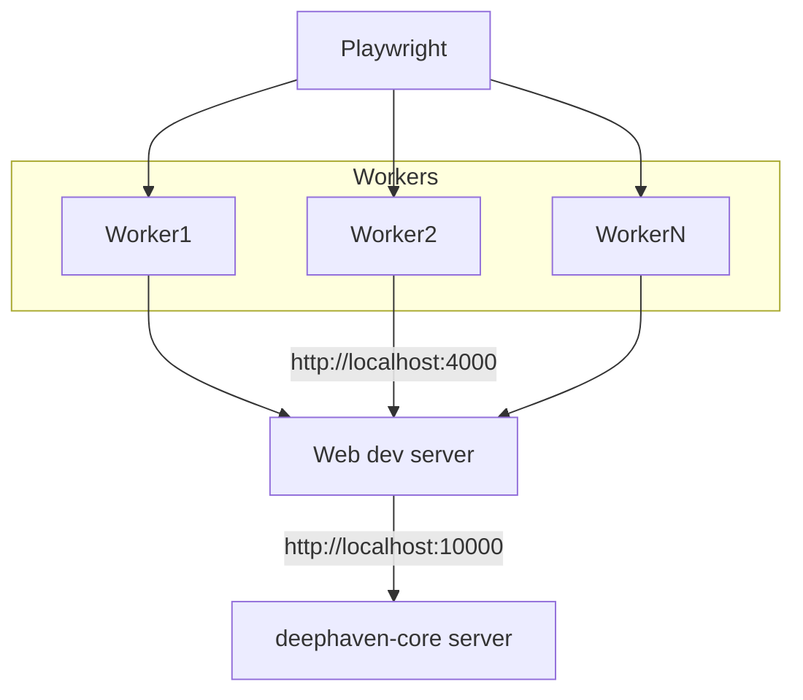
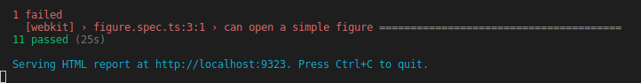
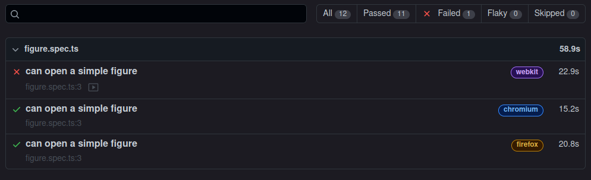
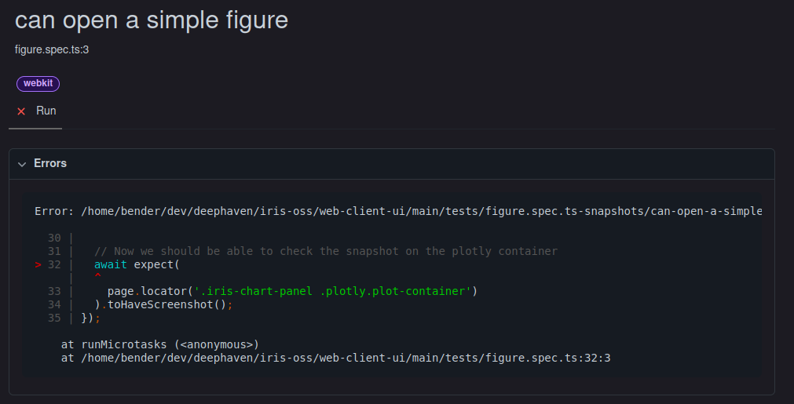
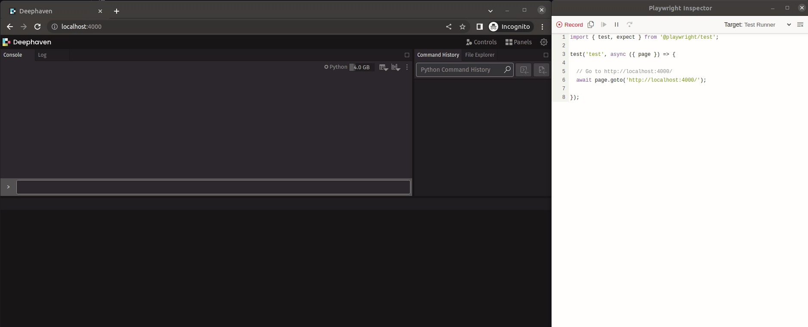

# Playwright Lunch 'n' Learn

## What is PlayWright?

[Playwright](https://playwright.dev/) is a end-to-end testing library. It can run tests in multiple browser environments to ensure proper operation of our application.

## Overview

Playwright will connect with the web dev server so we can connect test out the latest Web UI code with an existing deephaven-core server.

By default, playwright uses multiple workers to run tests in parallel. These workers will run tests in multiple browsers configured in `playwright.config.ts` (chromium, firefox, webkit by default), as well as running tests from different files simultaneously. This helps the tests run faster, but you should be aware of the multiple workers so that you write tests that do not conflict when running concurrently with other tests that could be potentially running.



## Running Tests

Playwright tests can be run by executing `npx playwright test`. By default they are executed in Headless mode, meaning the browser is not visible or open.

## Viewing Report

By default, after running the tests, if there is a failure you will be able to view the report:



Opening the report will give you details on which tests are failing:



You can then open the details of each report, showing which step within your test failed, along with a video to help with debugging:



## Writing Tests

We use React Testing Library to write our unit tests. Playwright uses slightly different syntax, but there is a [Cheat Sheet](https://playwright.dev/docs/testing-library#cheat-sheet) that details how to write equivalent tests in Playwright which can be handy.

### Codegen

You can use a generator to write the tests for you. Run `npx playwright codegen http://localhost:4000`, and then perform the actions you would like to do in your tests, and code will be generated for you. After generating tests, you may want to clean up some of the selectors, and/or write some `expect` checks to verify what is happening on the screen.



Often the selectors generated from codegen are somewhat convoluted, so you will want to review them to see if they can be handled differently.

### Screenshots

Some elements (such as our Grid or plots) are canvas based elements, and we cannot verify the contents of the elements through the DOM alone. In these cases, we can use [test snapshots](https://playwright.dev/docs/test-snapshots). An example of checking a grid element for a screenshot:

```
  await expect(page.locator('.iris-grid-panel .iris-grid')).toHaveScreenshot();
```

By default, Playwright will generate the screenshots on first run. If you need to force screenshots to update, you can run `npx playwright test --update-snapshots`.

TODO: For CI, we also need to generate screenshots matching the OS that will be used in CI. Because CI may run in a different OS/Environment, we can [create a docker container to generate the snapshots](https://playwright.dev/docs/test-snapshots).

## Debugging Tests

It can be difficult to debug tests in headless mode because you can't see what's going on. However, if tests fail, Playwright will automatically [retain a video](https://playwright.dev/docs/videos#record-video) which you can view to see why the test may be failing.

If you want to debug tests and be able to follow along as the test is running, you can run tests in Headed mode, where you can step through code and see what the tests are seeing. To run tests in Headed mode, pass in the `--headed` argument, e.g.: `npx playwright test --project=chromium --headed --debug`
