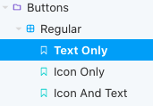
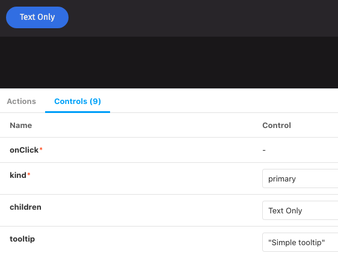
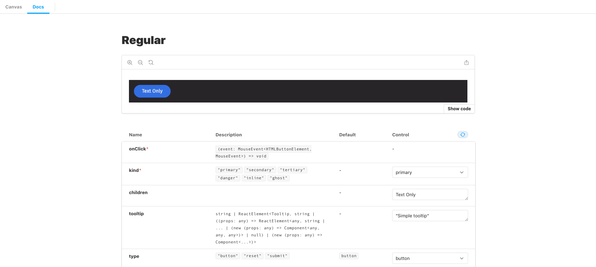

# Storybook Lunch 'n' Learn

## What is Storybook? ([Storybook website](https://storybook.js.org/docs/react/get-started/introduction))

Storybook is a tool for developing UI components in isolation. It can also be used to document and test UI components.

Storybook can be started in any powell or newer branch with `npm run storybook`

## What is a story?

A story is a specific, “interesting” state of a component. Stories are gathered by Storybook based on files ending with `.stories.(j|t)sx?`.



In this example, there is 1 file which represents ‘Buttons/Regular’ and contains 3 stories within it.

## How does Storybook generate that list?

There are a few key points about stories.

1. The default export is required to show up in the list. It is an object which must contain at least a title string. It can also contain other info which Storybook addons will use. The above hierarchy can be achieved with the following.

   ```javascript
   export default {
     title: "Buttons/Regular",
   };
   ```

   Any additional story files with the `Buttons` prefix will be merged and have a different dropdown at the same level as `Regular`.

2. Individual stories are named exports which are functions returning components. In the example above, there are 3 stories grouped under regular buttons.

   ```javascript
   export const TextOnly;
   export const IconOnly;
   export const IconAndText;
   ```

   The display name can also be changed using the following.

   ```javascript
   TextOnly.storyName = "My text only button";
   ```

## How do I write stories?

A story can be as simple as the following if `Button` did not require any props.

```javascript
export const MyButton = () => <Button />;
```

This story is static and cannot be manipulated in any way in the Storybook interface. Instead, we should use a different syntax so Storybook's controls addon can be used.

## Controls addon ([link](https://storybook.js.org/docs/react/essentials/controls))

Storybook has a nice addon called controls which lets us manipulate the value of props in real-time. Here's an example of what it looks like.



Controls are auto-generated from PropTypes if the default export has a component specified.

```jsx
export default {
  title: "Buttons/Regular",
  component: Button,
};
```

We can also specify default args or arg types for all stories. For example if we wanted to default to primary buttons and add a background color picker, we could do the following:

```jsx
export default {
  title: "Buttons/Regular",
  component: Button,
  args: {
    kind: "primary",
  },
  argTypes: {
    backgroundColor: { control: "color" },
  },
};
```

## Specifying Args per Story

We might want to specify specific args for each story. The following code is how to set args for an individual story:

```jsx
const Template = (args) => <Button {...args} />;

export const TextOnly = Template.bind({});

TextOnly.args = {
  kind: "primary",
  children: "Text Only",
  tooltip: "Simple tooltip",
};
```

A few things to note here:

1. `Template.bind({})` is used to create a clone of the `Template` function.
2. `Template` just needs to return a component, so it can be nested if necessary.
3. Args are plain objects, so we can merge previous args using the spread operator.
   ```jsx
   TextOnly.args = {
     ...OtherStory.args,
     tooltip: "My new tooltip",
   };
   ```

## Actions Tab ([link](https://storybook.js.org/docs/react/essentials/actions))

We can use actions in Storybook to check that event handlers are being triggered. These actions will be logged in the actions tab. We can define specific actions or use regex as follows (note we do not need both as the definitions will overlap):

```javascript
export default {
  title: "Button",
  component: Button,
  argTypes: { onClick: { action: "clicked" } },
  parameters: { actions: { argTypesRegex: "^on.*" } },
};
```

## Documenting Components ([link](https://storybook.js.org/docs/react/writing-docs/introduction))

By default our stories have a basic docs page generated which includes a preview, code snippet, and arg table.



For some components/stories, that may be enough. If we want to expand it though, we can have a few options: add comments to source, or use MDX, an expansion of markdown that also combines JSX syntax.

There are a few options for the docs page. Option 3 is probably preferable for keeping stories and docs files separate, but working together.

1. Use Storybook auto-generated docs. The args table will use prop type code comments if they are provided to enhance the description.
2. Remix the component docs in JSX using doc blocks from the Storybook docs addon.
3. Add a MDX file, remove the default export from JSX file, and import stories from the JSX file to MDX ([more info](https://github.com/storybookjs/storybook/blob/master/addons/docs/docs/recipes.md#csf-stories-with-mdx-docs))
4. Use MDX to define the stories and docs in a single file

### Adding Comments to Source

This just adds to the description of the args table. If you add a multiline comment to the type definition in TypeScript or PropTypes definition in JavaScript, that comment will be added to the Description section of the args table. An example in typescript is:

```ts
type ButtonProps = {
  /**
   * Applies active styling to the button for inline toggles.
   */
  active?: boolean;
};
```

### Remixing Component Docs ([link](https://storybook.js.org/docs/react/writing-docs/docs-page#remixing-docspage-using-doc-blocks))

Inside the JSX default export, we can specify the docs page format without needing to write MDX. DocBlocks are useful to use here. This would look something like the following:

```jsx
import React from "react";

import {
  Title,
  Subtitle,
  Description,
  Primary,
  ArgsTable,
  Stories,
  PRIMARY_STORY,
} from "@storybook/addon-docs/blocks";

import { Button } from "./Button";

export default {
  title: "Components/Button",
  component: Button,
  parameters: {
    docs: {
      page: () => (
        <>
          <Title />
          <Subtitle />
          <Description />
          <Primary />
          <ArgsTable story={PRIMARY_STORY} />
          <Stories />
        </>
      ),
    },
  },
};
```

### Using MDX with JSX for Stories ([link](https://github.com/storybookjs/storybook/blob/master/addons/docs/docs/recipes.md#csf-stories-with-mdx-docs))

If the default export is removed from the JSX file and instead a `MyComponent.stories.mdx` file is created, the MDX file can use the stories defined in the JSX file. The MDX file is what defines the entries for Storybook, but the story definitions are kept separated.

### Using MDX Alone ([link](https://storybook.js.org/docs/react/writing-docs/mdx))

MDX can be used instead of JSX for stories. MDX is markdown with JSX. Files have the name `MyComponent.stories.mdx`. Note that these will replace JSX stories if both exist with the same name.

Basically, the MDX file will be displayed as the "Docs" tab and the individual stories will be pulled from the MDX tags. The following would be a basic MDX story.

```jsx
import { Meta, Story, Canvas } from '@storybook/addon-docs/blocks';
import { Button } from '../components/Button';

<!--- Equivalent to default export --->
<Meta title="MDX/Button" component={Button} />

export const Template = (args) => <Button {...args } />

<!--- Used in place of named exports --->
<Story name="Text Only" args={{
  kind: 'primary',
  children: 'Text Only',
  tooltip: 'Simple tooltip',
}}>
  {Template.bind({})}
</Story>

<!--- Put in a canvas to get code snippets --->
<Canvas>
  <Story name="Text Only" args={{
    kind: 'primary',
    children: 'Text Only',
    tooltip: 'Simple tooltip',
  }}>
    {Template.bind({})}
  </Story>
</Canvas>
```

## Configuring Storybook ([link](https://storybook.js.org/docs/react/configure/overview))

Storybook uses the `.storybook/` directory to handle changes to the default config. Some of these configs can also be used to wrap every story. For example, our config uses the following as part of the `preview.js` file.

```js
export const decorators = [
  (Story) => (
    <Provider store={store}>
      <div className="style-guide-container">
        <Story />
      </div>
    </Provider>
  ),
];
```

This gives all of our stories access to the our mock redux store from the old styleguide and puts everything in a container.
